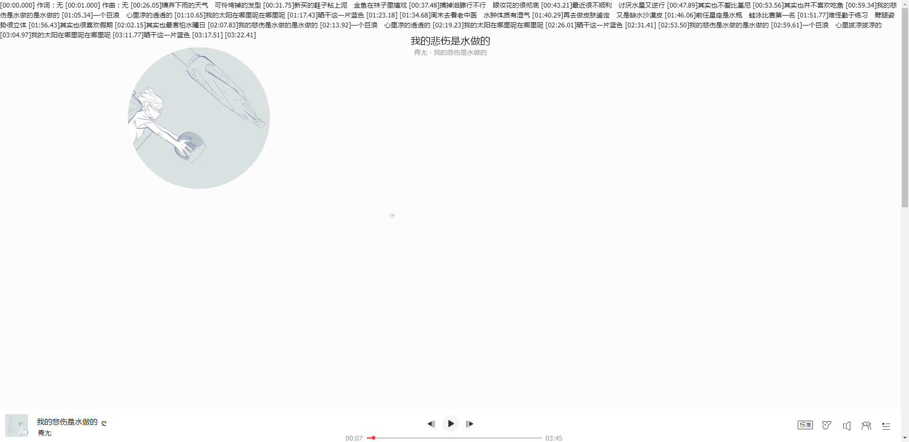
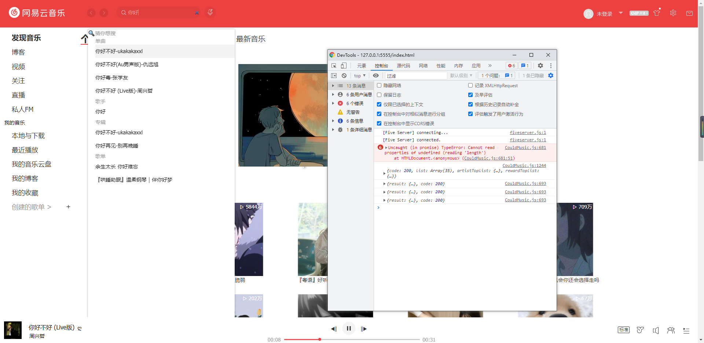

##### 1

这是最初的视图，因为刚开始写大框架的时候没怎么用flex布局

##### 2

所以不是放到最大就很布局就有问题，因为发现后已经写了很多了，要改的话要改很多地方，怕哪个地方改错了到时候一直找不到问题，系统的缩放与布局我设置的100%，笔记本一般是125%，布局也会有偏差。

​		

##### 3

歌曲播放进度条会移动，进度条和声音都能调整，但只能拖拽那个点，点击某个位置跳转的功能我没有做。。。。。

​		

##### 4

跨域问题是靠插件解决的，如果直接打开就会报错。有时候用插件打开后刷新也会报错，但过会儿就好了。不知道为什么。

##### 5

点击某个歌单封面能跳转到详细内容，等歌单内的歌曲加载后就能点击播放了，点击播放全部能把歌单里面的歌曲添加到播放列表，点击右下角小按钮能打开播放列表。具备上一首下一首功能，歌曲的时间我用了
audio的 canplaythough 来获得，但是在for循环里面的异步函数，能获得所有的时间，但是不能调用，然后时间也会变化成最后一个音频的时间，用了封闭函数也解决不了，递归又不怎么会用..........
如果点击了一个歌单马上回到主界面点击另一个歌单的话会出现两个歌单一起加载的bug，但后面那个会覆盖前面那个，因为是用for循环来做的，所以如果后面的歌单歌曲没有前面的多的话，可能会出现虚表紊乱的bug，这个我改了半天没有改好；

##### 6

评论是可以正常看的（但是不能评论...），收藏者没有要求所以没做，歌单的简介如果过长了就会有布局bug，过长省略的功能没有做。

##### 7

音乐播放图片会转动，但是这个歌词我实在不知道应该怎么用......，所以歌词的界面我就没有做了......

##### 8

登录后可以从左下角查看自己的歌单，点击同样可以播放.保留登录状态不会做，taken查了很多资料都不会用，也用了接口文档说的时间戳试了试也不行。

##### 9

热搜榜点击可以搜索，点击搜索的内容可以播放。hot图片我实在放不小，用接口文档里面的方法设置尺寸它会被裁减，不全....

##### 10

搜索建议，有时候会读取不到长度，应该是访问的太频繁了的原因，(我调用的时间是按下键盘就刷新一次)。点击建议里面的歌曲可以播放，点击回车可以搜索内容，点击搜索列表也可以播放

##### 11

歌单广场做了分类功能，点击全部歌单里面的一个也可以跳转到详细页，分类后点击不行，然后我忘记做返回全部歌单的按钮了。

##### 12

排行榜，布局有一些简陋.....点击图片也可以得到详细信息，功能和之前的都一样

歌手榜单没有做，播放列表也很简陋，但是可以点击播放，不知道为什么我一用定位或者浮动播放列表就会乱，所以就没怎么布局，
播放器不具备播放完自动播放下一首的功能，我用parseint来获取歌曲总时长和当前时长，设立了一个当它们完全相等的情况下点击下一首，但是没有作用，也不报错。

